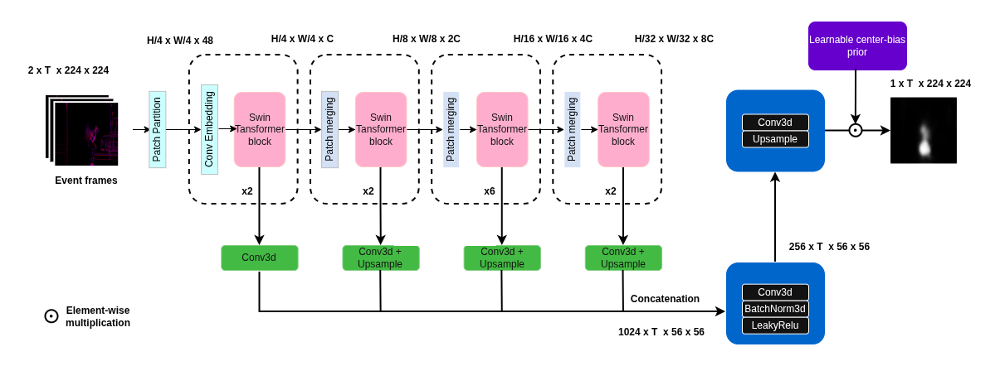
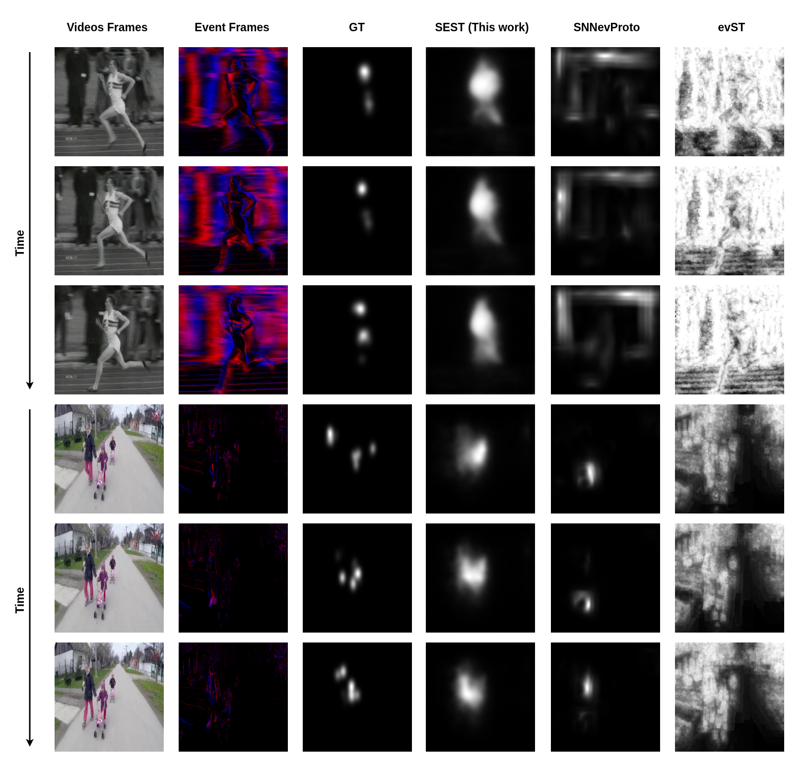

# SEST: Saliency Transformer for Event Data

Official PyTorch implementation of **"Exploring Deep Learning for Event-Based Saliency Prediction with a Transformer-Based Model"**.

Romaric Mazna, Sai Deepesh Pokala, Jean Martinet
*i3S / CNRS, Université Côte d'Azur*

**Accepted at ICONIP 2026.**

> [paper](https://arxiv.org/abs/2605.23790) | [arXiv PDF](https://arxiv.org/pdf/2605.23790) | [supp](./docs/supplementary.pdf) | [project page](https://romageek.github.io/sest) | [N-UCF Sports dataset](https://doi.org/10.5281/zenodo.20729613)

<!-- TODO: replace the supp / project page links above once they are live. -->

[](https://arxiv.org/abs/2605.23790)
[](https://doi.org/10.5281/zenodo.20729613)
[](https://www.python.org/downloads/)
[](https://pytorch.org/)
[](./LICENSE)

---

## News

- **September 2026** Code and pre-trained checkpoints released.
- **August 2026** SEST accepted at **ICONIP 2026**.
- **June 2026** N-UCF Sports released on Zenodo.
- **May 2026** Preprint available on [arXiv](https://arxiv.org/abs/2605.23790).

---

## Introduction

**SEST** (*Swin Event-based Saliency Transformer*) predicts dynamic saliency maps directly from event data, using a self-supervised pretrained event Swin Transformer backbone and a lightweight CNN decoder. It is the first deep learning approach to event-based saliency prediction, and it outperforms existing event-based methods while narrowing the gap to RGB models.

We also release two synthetic event saliency benchmarks, **N-UCF Sports** and **N-DHF1K**, rendered from the corresponding RGB benchmarks.

See the [paper](https://arxiv.org/abs/2605.23790) for details.

---

## Framework

<div align="center">

<br>
<em>Figure 1 — SEST architecture. A voxel-grid event representation is encoded by a self-supervised pretrained event Swin Transformer; features from the four backbone stages are projected and fused by a CNN decoder that outputs a per-frame saliency map.</em>
</div>

## Qualitative

<div align="center">

<br>
<em>Figure 2 — Qualitative results on N-UCF Sports and N-DHF1K.</em>
</div>

---

## Requirements

```bash
git clone https://github.com/romageek/sest.git
cd sest

conda create -n sest python=3.10 -y
conda activate sest

# Install PyTorch matching your CUDA version: https://pytorch.org/get-started/locally/
pip install torch torchvision --index-url https://download.pytorch.org/whl/cu121

pip install -r requirements.txt
```

Main dependencies are listed in [`requirements.txt`](./requirements.txt).

### Pretrained backbone

SEST is initialised from a **self-supervised event-based Swin Transformer** pretrained with [ECDDP](https://github.com/Yan98/Event-Camera-Data-Dense-Pre-training). Download the backbone checkpoint and point to it from the config:

```yaml
# config/saliency/swin_small.yml
network:
  pretrained_checkpoint: pr.pt
```

---

## How to get the dataset

We use two synthetic event saliency benchmarks, rendered from the corresponding RGB benchmarks using ESIM and inheriting their human fixation annotations.

| Dataset | Source | Train | Val | Test | Availability |
|---|---|---|---|---|---|
| **N-UCF Sports** | UCF Sports | 103 | 15 | 32 | [Zenodo](https://doi.org/10.5281/zenodo.20729613) |
| **N-DHF1K** | DHF1K | 500 | 100 | 100 | Not yet published — coming soon |

**N-UCF Sports** contains events rendered from the UCF Sports saliency dataset (9 action categories; observers were asked to identify the ongoing action). **N-DHF1K** is rendered from DHF1K, where observers viewed the videos freely.

### Download N-UCF Sports

The dataset is archived on Zenodo with a citable DOI:

**https://doi.org/10.5281/zenodo.20729613**

```bash
# download the archives from the Zenodo record above, then
unzip 'N-UCF-Sports*.zip' -d /path/to/N-UCF-Sports
```

### Expected layout

```
N-UCF-Sports/
├── training/
│   └── <video_id>/
│       ├── events.h5        # raw events (x, y, t, p)
│       └── fixations/       # per-frame fixation maps + fixation points
├── val2/
└── test/
```

<!-- TODO: confirm the per-video file names / formats. -->

Point the config at the three splits. They are **lists**, so several datasets can be concatenated:

```yaml
# config/saliency/swin_small.yml
datasets:
    train_dir: [/path/to/N-UCF-Sports/training]
    val_dir:   [/path/to/N-UCF-Sports/val2]
    test_dir:  [/path/to/N-UCF-Sports/test]
    event_bins: 21        # number of temporal bins in the voxel grid
    use_polarity: true    # keep positive / negative polarities as separate channels
    batch_size: 20
```

> `head_main.num_classes` must equal `datasets.event_bins`: the model outputs one saliency map per temporal bin.

---

## Repository structure

```
sest/
├── assets/                      # figures used in this README
├── config/
│   └── saliency/
│       └── swin_small.yml       # main training / inference config
├── data/                        # voxel-grid construction, dataloaders
├── model/                       # SEST backbone, decoder, prediction head
├── metrics/                     # AUC-J, NSS, CC, SIM
├── trainer/                     # TrainerSaliency and training loop
├── utils/
├── experiments/                 # run outputs (logs, checkpoints)
├── train_sal.py                 # training entry point
├── eval_sal.py                  # evaluation entry point
└── vis_sampels.py               # qualitative visualisation
```

---

## How to train

```bash
python3 train_sal.py --opt config/saliency/swin_small.yml --gpus 1
```

Multi-GPU:

```bash
python3 train_sal.py --opt config/saliency/swin_small.yml --gpus 4
```

| Flag | Description |
|---|---|
| `--opt` | Path to the YAML config |
| `--gpus` | Number of GPUs |

Default training schedule (set in the config): 30 epochs, base LR 0.08, 1 warm-up epoch, weight decay 0.01, mixed precision (`precision: 16`).

Logs and checkpoints are written under `exp_path` (`experiments/saliency/swin_small` by default), and follow the pattern
`cnn={fold}-epoch={epoch}-val_loss={loss}-val_acc={acc}.ckpt`.

We provide an example of pre-trained weights below.

---

## Inference

Download a pre-trained model:

| Model | Trained on | Download |
|---|---|---|
| SEST (Swin-S) | N-UCF Sports | `link` |
| SEST (Swin-S) | N-DHF1K | `link` |

Qualitative visualisation:

```bash
python3 vis_sampels.py \
    --opt config/saliency/swin_small.yml \
    --gpus 1 \
    --checkpoint cnn=0-epoch=13-val_loss=1.03-val_acc=0.00.ckpt
```

Quantitative evaluation on the test split:

```bash
python3 eval_sal.py \
    --opt config/saliency/swin_small.yml \
    --gpus 1 \
    --checkpoint cnn=0-epoch=13-val_loss=1.03-val_acc=0.00.ckpt
```

This reports AUC-J, NSS, CC and SIM on the directories listed under `datasets.test_dir`.

---

## Contact

If you have any questions relating to our work, do not hesitate to contact [me](mailto:mazna@i3s.unice.fr?subject=SEST), or open an issue in this repository.

---

## Citation

If you find this work useful, please cite:

```bibtex
@inproceedings{mazna2026sest,
  title     = {Exploring Deep Learning for Event-Based Saliency Prediction with a Transformer-Based Model},
  author    = {Mazna, Romaric and Pokala, Sai Deepesh and Martinet, Jean},
  booktitle = {International Conference on Neural Information Processing (ICONIP)},
  year      = {2026}
}
```

Preprint:

```bibtex
@misc{mazna2026exploringdeeplearningeventbased,
  title         = {Exploring Deep Learning for Event-Based Saliency Prediction with a Transformer-Based Model},
  author        = {Romaric Mazna and Sai Deepesh Pokala and Jean Martinet},
  year          = {2026},
  eprint        = {2605.23790},
  archivePrefix = {arXiv},
  primaryClass  = {cs.CV},
  url           = {https://arxiv.org/abs/2605.23790}
}
```

If you use the N-UCF Sports dataset, please also cite the Zenodo record: https://doi.org/10.5281/zenodo.20729613

---

## Acknowledgement

SEST is built using the awesome [ECDDP](https://github.com/Yan98/Event-Camera-Data-Dense-Pre-training) — we build directly on their code and use their self-supervised event pretraining to initialise our backbone. We warmly thank Yan Yang, Liyuan Pan and Liu Liu for releasing their work:

```bibtex
@inproceedings{yang2024eventcameradatadense,
  title     = {Event Camera Data Dense Pre-training},
  author    = {Yang, Yan and Pan, Liyuan and Liu, Liu},
  booktitle = {European Conference on Computer Vision (ECCV)},
  year      = {2024},
  url       = {https://arxiv.org/abs/2311.11533}
}
```

We also thank the authors of [DHF1K](https://github.com/wenguanwang/DHF1K) and of the UCF Sports saliency benchmark for making their fixation data available.

## License

Released under the MIT License — see [LICENSE](./LICENSE).
